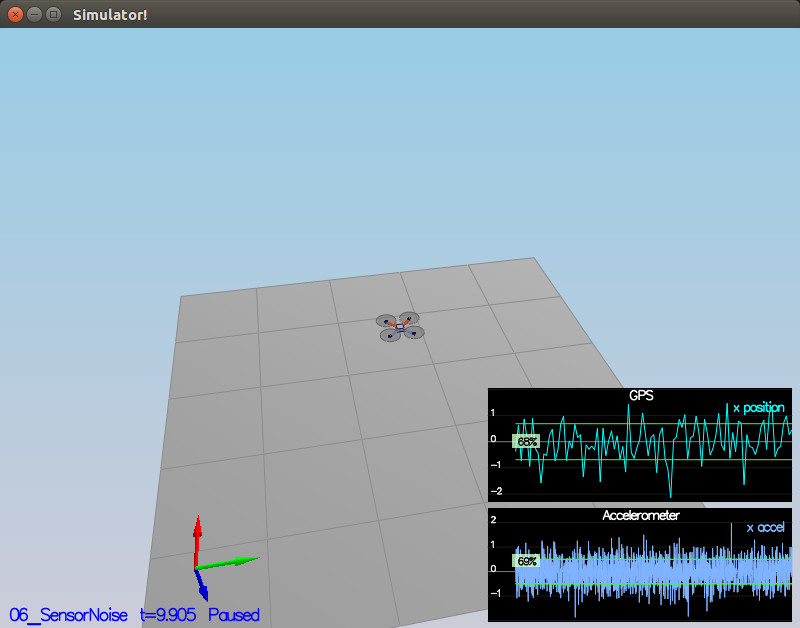
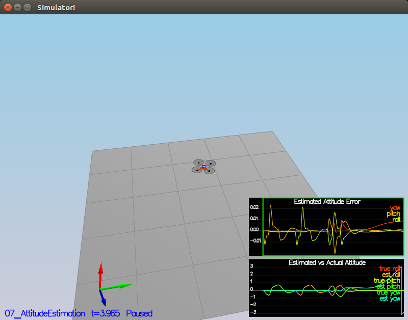
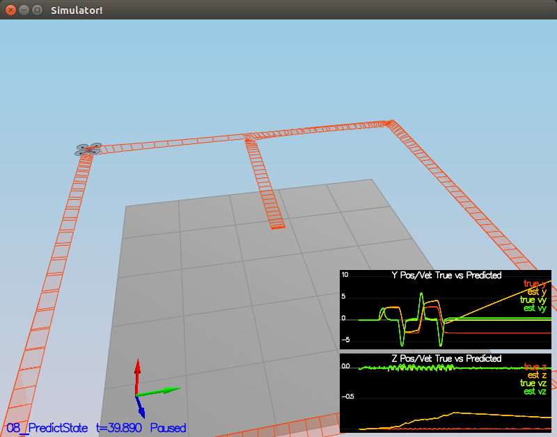
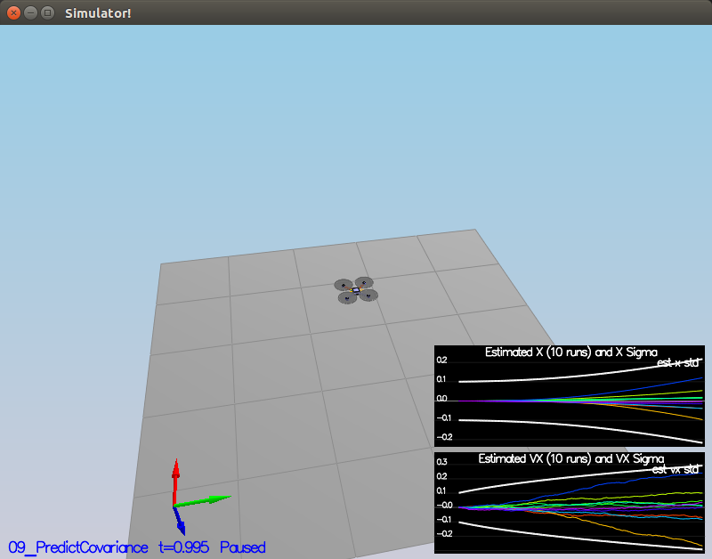
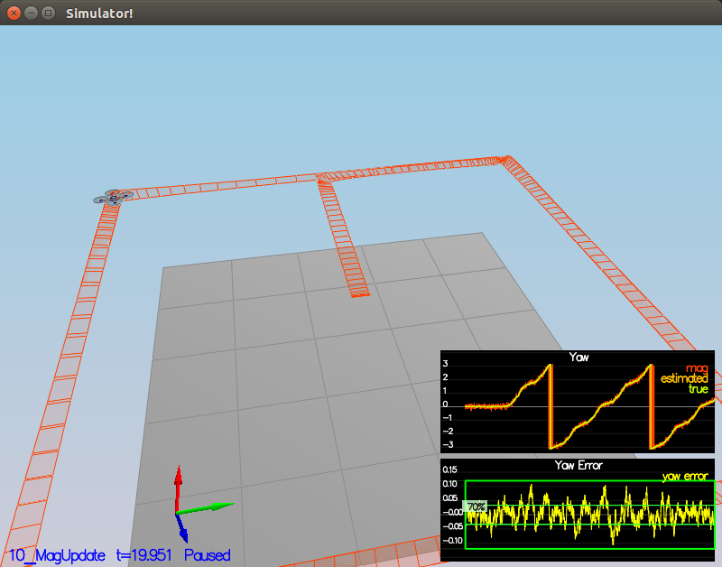
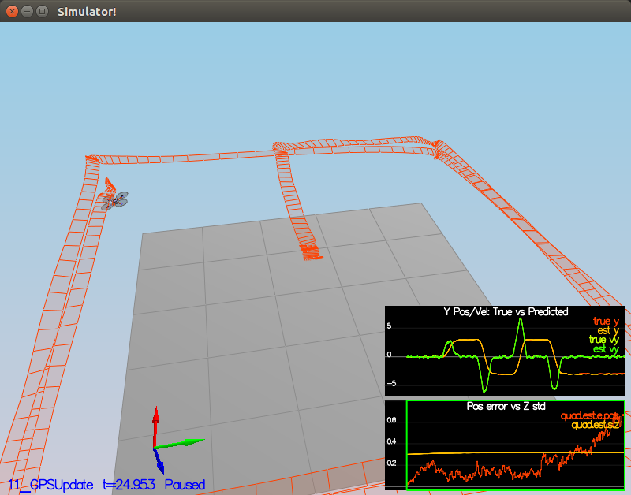
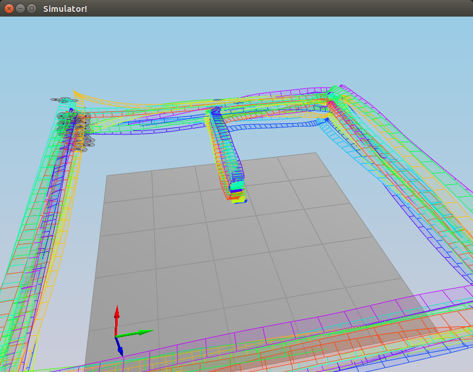

# Building an Estimator

## Code Descriptions ##

### __Sensor Noise__ ###

The measured standard deviation of the XY GPS position data is: `MeasuredStdDev_GPSPosXY = 0.6887253637447355`.  
The measured standard deviation of the XY acceleration data is: `MeasuredStdDev_AccelXY = 0.4990327609508956`.

These values were found by first extending the `Sim.EndTime` to 100 seconds to gain more sample data. Second, the `Graph::BeginLogToFile()` was temporarily edited to use `fopen()` in append mode, so that prior logged data would not be cleared when the simulation rolled over. The resultant data logged are contained within the `Quad.GPS.X.100.txt` and `Quad.IMU.AX.100.txt` files.

Finally, the simple Python script `06_NoisySensors.py` was used to calculate the standard deviations from the aforementioned files.

### __Attitude Estimation__ ###

In lines 100-108 of `QuadEstimatorEKF::UpdateFromIMU()`, an improved gyro rate integration scheme was implemented, replacing the small-angle approximation integration method.

The current attitude quaternion was multiplied by the quaternion derived from the gyro rate over the gyro delta time to produce the new attitude quaternion, and then the roll pitch and yaw values were extracted from the quaternion.

Equations 43-45 of Section 7.1.2 in `Estimation for Quadrotors` capture the gist of the implementation.

### __Prediction Step__ ###

Lines 175-194 of `QuadEstimatorEKF::PredictState()`, lines 225-234 of `QuadEstimatorEKF::GetRbgPrime()`, and lines 283-293 of `QuadEstimatorEKF::Predict()` constitute the implementation of the prediction step.

In `QuadEstimatorEKF::PredictState()`, the position of the predicted state is the velocity multiplied by a delta time (i.e. position) added to the current state. The velocity of the predicted state is the acceleration multiplied by a delta time (i.e. velocity) added to the current state.

In `QuadEstimatorEKF::GetRbgPrime()`, a direct implementation of Equation 52 of Section 7.2 of in `Estimation for Quadrotors` is performed.

Finally, in `QuadEstimatorEKF::Predict()`, a direct implementation of Equation 51 of Section 7.2 of in `Estimation for Quadrotors` is performed, and then then Algorithm 2 (Line 4) of Section 3 in `Estimation of Quadrotors` is implemented.

### __Magnetometer Update__ ###

In lines 348-358, in the `QuadEstimatorEKF::UpdateFromMag()` function, the parameters to the `QuadEstimatorEKF::Update()` function are defined. These follow from Equations 56-58 of Section 7.3.2 in `Estimation for Quadrotors`.

### __Closed Loop + GPS Update__ ###

In lines 320-324, in the `QuadEstimatorEKF::UpdateFromGPS()` function, the parameters to the `QuadEstimatorEKF::Update()` function are defined. These follow from Equations 56-58 of Section 7.3.1 in `Estimation for Quadrotors`.

### __Adding Your Controller__ ###

In `QuadControl.cpp`, lines 78-100, 144-147, 184-211, 258-278, 330-342, and 382-389 were added and the solution controller counterparts wre commented out. The de-tuned parameters are located in `QuadControlParams.txt` and not only work well for for Scenarios 6-11, but still pass for Scenarios 1-5 from the last project.

## Screenshots ##

### Scenario 6 ###

### Scenario 7 ###

### Scenario 8 ###

### Scenario 9 ###

### Scenario 10 ###

### Scenario 11 ###

### Scenario Monte Carlo ###

